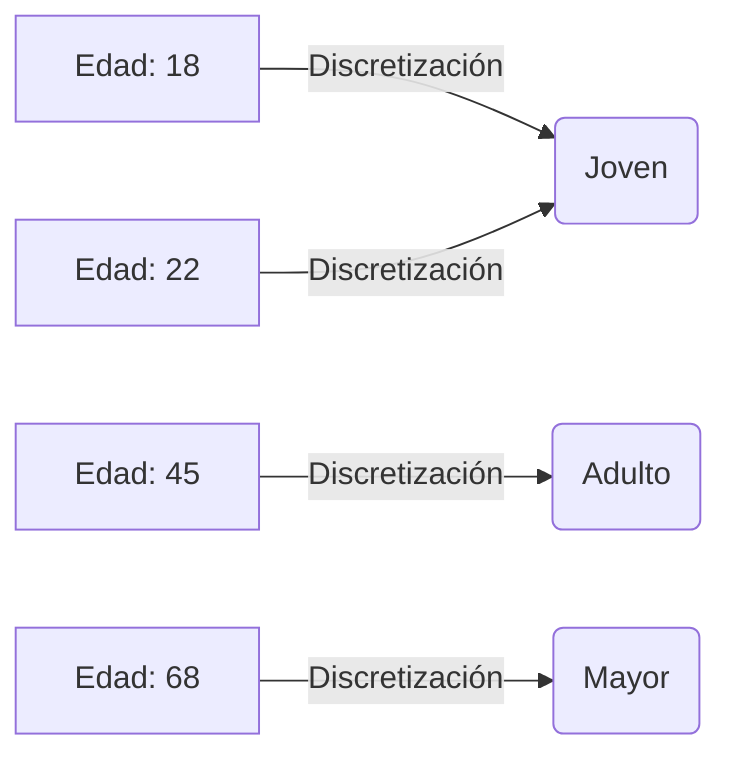

# 📚 Guía de Estudio Teórico: Procesamiento y Análisis de Datos (Unidad 1 y 2)

Esta guía recopila y explica los conceptos teóricos fundamentales presentes en los archivos de tus libretas de Jupyter, estructurados de manera clara para tu examen.

---

## 1. ETL (Extract, Transform, Load)
Es el proceso central en la integración de datos, utilizado para mover datos desde múltiples fuentes hacia un sistema centralizado (como una base de datos o un data warehouse) preparándolos para su análisis.

* **Extract (Extraer):** Consiste en leer y extraer la información de diversas fuentes de origen. En tu caso, involucra la lectura de archivos CSV (`pd.read_csv`) o Excel (`pd.read_excel`), especificando motores correctos (como `xlrd` para archivos `.xls` antiguos) y gestionando la lectura de múltiples hojas de cálculo simultáneamente.
* **Transform (Transformar):** Es la fase más crítica. Aquí los datos "crudos" se limpian, filtran, validan y formatean para que sean consistentes. Incluye la limpieza de nulos, eliminación de duplicados, corrección de errores y escalamiento numérico.
* **Load (Cargar):** Es la inserción de los datos ya transformados y limpios en la base de datos de destino (ej. MySQL). Implica respetar el modelo relacional (obtener y relacionar las llaves foráneas o IDs) mediante consultas y sentencias `INSERT`.

---

## 2. Data Cleaning (Limpieza de Datos)
Es el proceso de detectar, corregir o eliminar registros inexactos o corruptos de un conjunto de datos. En las libretas se dividen en 4 problemas principales:

### A. Valores Vacíos (Nulos)
Son los datos faltantes en el sistema. En Pandas te puedes encontrar 4 tipos principales:
* **`NaN` (Not a Number):** El más común, heredado de NumPy. Se usa en columnas numéricas. (Cuidado: si a una columna de enteros se le cuela un NaN, Pandas la convertirá a decimales flotantes).
* **`None`:** El vacío nativo de Python puro. Suele aparecer en columnas de texto o tipo Object.
* **`NaT` (Not a Time):** El equivalente al NaN pero exclusivo para columnas de Fechas y Horas.
* **`<NA>` / `pd.NA`:** El "vacío universal" moderno de Pandas (versiones 1.0+). Su gran ventaja es que no fuerza a los enteros a convertirse en decimales.

> **💡 Ojo con la palabra "NA":** 
> * **Si lo escribes en código:** Poner `['NA']` a mano en un diccionario de Python se interpreta como **texto puro**. Para Pandas es tan normal como la palabra "Hola".
> * **Si lo lees de un `.csv`:** Al usar `read_csv()`, Pandas tiene un detector inteligente. Si ve las letras "NA", "N/A" o "null" en el archivo, las convierte automáticamente a verdaderos vacíos (`NaN`). Si quieres evitar esto y obligarlo a que lo deje como texto normal, debes leer el archivo usando el parámetro `keep_default_na=False`.

¿Qué hacer con ellos (Data Cleaning)?
* **Eliminación:** Borrar los registros que tengan datos faltantes (ej. si toda la fila está vacía).
* **Imputación (Relleno):** En lugar de borrar, se sustituyen los valores nulos por un valor estimado para no perder la fila entera. Los métodos estadísticos más comunes son:
  * **Media (Promedio) / Mediana / Moda:** Rellenar con los valores centrales de esa columna.
  * **KNN (K-Nearest Neighbors):** Un algoritmo más avanzado que busca los registros ("vecinos") más similares y usa sus datos para estimar el valor faltante.

### B. Valores Duplicados
Registros que se repiten idénticamente. Se identifican analizando fila por fila o por un subconjunto de columnas y, por lo general, se eliminan directamente del conjunto de datos original (`drop_duplicates`).

### C. Valores Atípicos (Outliers)
Son números que se escapan drásticamente de la normalidad (ej. una casa que cuesta 100 veces más que el resto). Para identificarlos estadísticamente se usan los **Cuartiles (Q1 y Q3)** y el rango intercuartílico, con los que se calculan un **Límite Inferior (low_limit)** y un **Límite Superior (high_limit)**. Cualquier valor fuera de esa caja se considera atípico y suele ser filtrado para no sesgar el análisis.

### D. Datos Erróneos o Conflictivos
Errores de dedo, espacios en blanco al inicio o al final de las palabras, o tipos de datos incorrectos. Se solucionan aplicando reemplazos, expresiones regulares o transformaciones de strings (como quitar espacios o cambiar formatos).

---

## 3. Preparación y Transformación de Datos

Antes de aplicar modelos de inteligencia artificial o gráficas complejas, los datos numéricos a veces necesitan cambiar de "forma" o escala:

### 3.1. Generalización (Discretización)
Consiste en tomar valores numéricos continuos (infinitos) y agruparlos en "categorías" o contenedores fijos (*bins*). Es útil cuando el rango importa más que el número exacto.

* **Ejemplo Práctico:** En lugar de analizar las edades exactas de los clientes (18, 22, 45, 60), se agrupan en etiquetas categóricas para perfilar mejor.

### 3.2. Escalamiento y Normalización
Las matemáticas de los modelos se "confunden" si una columna (ej. Sueldo: $50,000) tiene números gigantescos comparada con otra columna (ej. Edad: 25). Ambas técnicas ajustan los números a una escala similar para que pesen lo mismo, sin perder su proporción original.

* **MinMaxScaler (Reescalamiento):** Comprime o estira todos los datos para que siempre encajen en un rango exacto de **`0` a `1`**. 
  * *Ejemplo:* Si el rango de sueldos de tus empleados es de $10,000 (mínimo) a $50,000 (máximo). 
    * El que gana $10,000 se vuelve `0`.
    * El que gana $50,000 se vuelve `1`.
    * El que gana la mitad ($30,000) se vuelve `0.5`.

* **StandardScaler (Normalización):** Cambia el promedio (media) de todos los datos a **`0`** y mide qué tan lejos está cada registro de ese "centro" en desviaciones estándar. Aunque matemáticamente no tiene límites fijos, en la práctica el 99% de los datos caerá en un rango aproximado de **`-3` a `+3`**.
  * *Ejemplo:* Si el promedio del grupo es 25 años. 
    * Alguien de 25 años se convierte en `0`.
    * Alguien muy grande (40 años) se vuelve un valor positivo como `+1.8`.
    * Alguien muy joven (18 años) se vuelve un valor negativo como `-0.9`.

### 3.3. Smoothing (Suavizado)

**Explicación Simple (Intuitiva):**
Imagina que haces una gráfica de tus gastos diarios: un día gastas $500, al otro $10, luego $300... La gráfica se verá como una montaña rusa llena de picos violentos. A esos brincos caóticos que no te dejan ver el panorama completo se les llama **"ruido"**. El suavizado sirve para "planchar" esa gráfica. En lugar de ver día por día, sacas un **Promedio Móvil** (por ejemplo, sacando el promedio de 7 en 7 días). De esta forma, matas los picos raros de un solo día y obtienes una curva suave que te muestra la **tendencia real**: si en general tus gastos están subiendo o bajando.

**Explicación Técnica:**
Se utiliza para eliminar el "ruido" (variaciones aleatorias) en datos que cambian a lo largo del tiempo (Series de Tiempo). La técnica estadística más común es el **Promedio Móvil**, que consiste en calcular el promedio de un número fijo de observaciones (por ejemplo, ir sacando el promedio de los últimos 7 días constantemente) en lugar de graficar el dato crudo diario. Al hacer esto continuamente, se revelan tendencias mucho más claras.

---

## 4. Conceptos Base de Análisis (Pandas)

* **Dataframe:** Estructura de datos bidimensional (como una hoja de cálculo con filas y columnas) que es el pilar para analizar datos en Python.
* **Filtros y Condicionales:** Capacidad de extraer un subconjunto de datos cumpliendo reglas lógicas (`AND`, `OR`, `NOT`) o buscando pertenencia en listas (`IN`).
* **Búsqueda de Patrones (Strings/Regex):** Uso de métodos textuales para encontrar registros que empiecen, terminen o contengan ciertas palabras, a veces ignorando mayúsculas/minúsculas.
* **Funciones de Agregación:** Funciones matemáticas que resumen muchos datos en uno solo. Ejemplos: `MAX`, `MIN`, `AVG` (Promedio/Media), `SUM` (Suma total) y `COUNT` (Conteo de registros).
* **Agrupamiento (Group By):** Técnica analítica que consiste en dividir los datos en categorías (ej. agrupar por 'Tipo de habitación') y luego aplicarle una función de agregación a cada grupo por separado (ej. contar cuántos hay de cada tipo).
